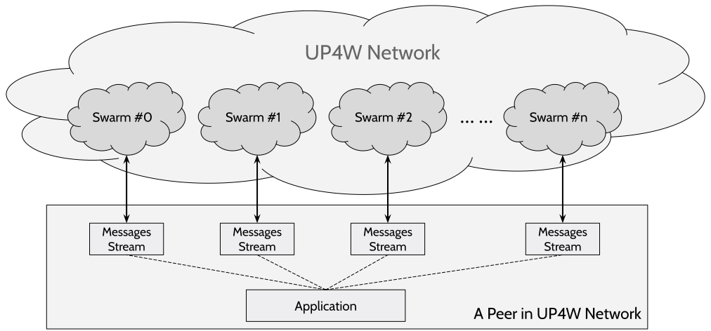

# UP4W: United Peers for Web 3.0

UP4W is a decentralized network for development and deployment of Web 3.0 applications
that consist only peers with equal duties and rights. 
There are no servers or centric services that have privileges over other peers in the network.
UP4W shares the same decentralization nature of blockchain systems, however it is not for consensus.
Instead, UP4W network focuses on discovery, connection, privacy and trustworthy information exchange
among peers of common interests. 

UPW protocol family is the agreement among peers to establish such unstoppable, tamperproof and censorship-resistant network of users.
UPW protocol family abstracts the communication and coordination behaviors of peers as *message-sending* with one
sender and one-or-multiple recipients, which supports multiple applications like 
instant messenger, social media, content publishing, interactive games and etc. 
It is not based on blockchain, thus it works for enormous traffic volume and massive user base.

# How It Works
For a specific application, every user runs a peer on its own device with UPW protocol family and participates 
in one or more *swarms* that exchange, synchronize and relay *messages* in real-time. 
Each message is sent as a broadcast within the swarm that is relayed by all peers in it including recipients.

* Such a broadcast behavior ensures the original sender is hidden in the crowd of relayers.
Both message content ([UEP-14](./docs/uep_0014.md))
and social metadata ([UEP-15](./docs/uep_0015.md)) are protected, which provides ultimate privacy and tamperproof beyond all existing social/message platforms.
* Broadcast behavior relies on reasonable number of active users only, there is no single-point-of-failure in the network,
which makes the network unstoppable.
* Cryptographic social identity ([UEP-13](./docs/uep_0013.md)) plus redundant routing paths between peers exhibits best censorship-resistance ever before.

 

An application on UP4W network (as illustrated above), will plan multiple independent swarms to
partition user groups and communication scenarios. 
The scale of each swarm is limited to require a reasonable effort in each peers so that an application can be scaled
to handle large user base with massive traffic. Principles of application design is discussed in [UEP-0](./docs/uep_0000.md).

 

# Open Protocol and Evolving
UPW protocol family is open and continuously evolving. It welcomes technical inputs and application ideas from anyone. 
Evolving of UP4W protocol specifications is tracked by Enhancement Proposals (UEPs), which describe standards
including core protocol specifications, client APIs, data formats and etc. 
UEPs are the primary approach for collecting new features, enhanced designs and protocol research from the community.
[A complete list of UEPs is available in here](./docs/index.md)

