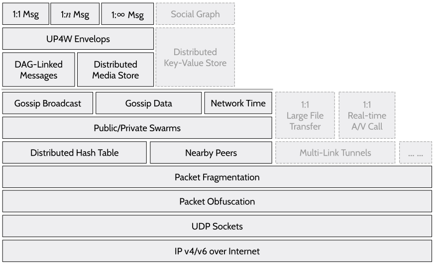
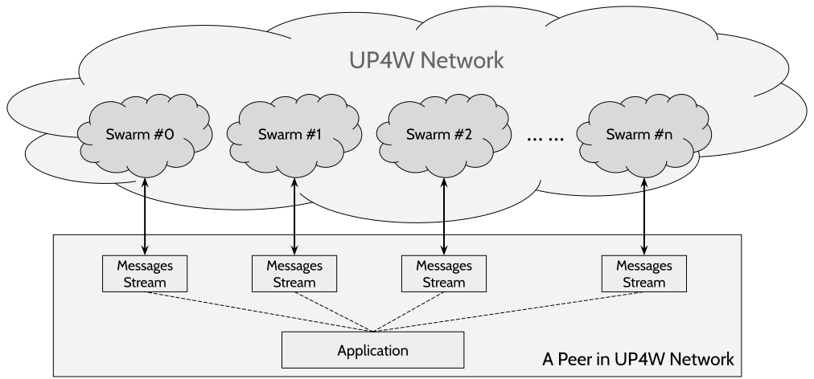

##### UPW/Core/UEP-0: Essentials, Architecture and Infrastructure   Rev#0: 2/8/2023 by Core Dev Team   Status: Revise

# Essentials, Architecture and Infrastructure

## Motivation
UPW protocol family stacks up to serve as a common infrastructure for building decentralized Web 3.0 applications. 
Each protocol layer provides a simple, specialized functionality to fulfill specific interaction needs among peers in the network.
UPW abstracts the communication and coordination behaviors of peers in a decentralized application as *message-sending* with one
sender and one-or-multiple recipients, which supports applications like instant messenger, email system, social media, content
publishing, remote collaboration, online forum, digital matchmaking, open marketplace and interactive games.

Applications may utilize protocols in different ways, have different structures of message flows, employ different schemes for organizing users, and have different interpretations of message payloads.
While all applications share the same infrastructure operated by a network of equal peers jointly.
It is based on P2P techniques which is **the only time-tested approach** to create and operate a purely decentralized network
with long-term success, such as the Bitcoin Network 
and the BitTorrent/Mainline-DHT Network.

## Essentials

### Equal Peers
A peer is a user device (e.g. a laptop or a mobile phone) connected to the Internet and joined the UPW network, which 
is usually called as a node. Unlike the server-client model in Web 2.0, there is no division of roles among peers. All peers respond to information requests from any other peers, and they all rely on each other to relay and spread information. This equal distribution 
of duties and rights applies to all peers without exception.

### Broadcast Swarm
Swarm is a permissionless group of interconnected 
peers for synchronizing information of common interest. 
A peer may choose to join different swarm 
simultaneously in runtime as the application specifies. 
Any peer is allowed to broadcast new information, such as new messages, which will be relayed and forwarded
by all other peers participating in the swarm. 

### User Identity
A user is identified by the public key, and posses the corresponding private key secretly for signing and encryption.
Each piece of information generated by a user comes with a digital signature or an authenticated encryption, 
which proves the authenticity of the information. An unique identity of a UPW user can be generated on any device 
independently without requiring even an Internet connection.

### End-to-End Encryption
E2EE is a standard method to protect message content, which is certainly an essential component of UPW protocols.
For any message being transferred in the network, its content is encrypted and can only be decrypted by its sender and recipient. 
At the same time, the metadata of the message, 
including the identity of the sender and recipient,
is not encrypted for routing and delivery, which is disclosed to any relay server or cloud service and 
used for massive user monitoring and social relationship analyzing.

### Implicit Recipients
Beyond E2EE, sensitive metadata of messages, 
especially identities of the sender and recipient, should be protected.
In the UPW network, a recipient is specified as a 
short time-varying digest of the mutual secret known 
as *Implicit recipients*, without revealing the identities of the sender and recipient to any third party.

### Peer Anonymity
Information exchange between peers requires no user authentication, which fundamentally eliminates 
IP-based user tracking.
The equality nature of peers ensures that data transfer behavior of a peer will not reveal the identity of the peer owner.
Thus, it is very difficult to associate a user with an active peer in UPW network even with packet sniffing.

## Architecture

 

The figure above illustrated an overview of the UPW protocol stack and its dependencies among them. Each peer in the 
network runs entire or partial stacks to discover 
other peers within a swarm and synchronize information with them. 

### UDP Sockets
The server-client model in Web 2.0, a client communicates with only a few number of servers and each time fetches a large bulk of data using HTTP connection via TCP sockets.
On the contrary, UPW protocol primarily uses connectionless UDP sockets for efficient communication with hundreds and thousands peers along the time and each time fetches a small piece of data.
Both IP v4 and v6 Internet are leveraged in UP4W network.

In UPW protocol stack, only a single UDP socket (*primary socket*) with a random, or system-assigned,
port is created for network I/O. 
All packets working for different protocols are multiplexed and reuse the same UDP socket. 
For dual-stack devices, an addition one UDP socket is created dedicate for IPv6 network.

### Packet Obfuscation
An optional stack for stateless reversible data transformation of packets in transmission. 
It is a countermeasure to protocol-based packet filtering set by local ICP or public WIFI provider. 
For example, we observed that any packet with the mainline DHT protocol header will be dropped in some places. 
(UEP-6)

### Packet Fragmentation
A simple non-interactive protocol allows to send packet that is a bit larger than MTU size, occasionally. (UEP-7)

### DHT
Distributed hash table (DHT) is a protocol for peer discovery within a given swarm. 
UP4W network reuses mainline DHT protocol, plus a few extensions, which is backward-compatible with BitTorrent Network.
(UEP-1;UEP-2;UEP-3)

### Nearby Peers
A protocol for discovering peers of devices in the local area network by utilizing subnet broadcast. (UEP-8)

### Public/Private Swarms
As multiple swarms can be instantiated and joined, this stack allows packets received from different swarms 
to be differentiated. 
A private swarm requires a secret before joining that is pre-negotiated and known to members with
permission (UEP-4). Also, a unified multicast stack is provided by leveraging both peers discovered based on DHT and
nearby devices.

### Network Time
Timestamps in UP4W network is based on the network time by default, which is an average time aggregated and consented
in the entire network. (UEP-9)

### Gossip Broadcast
A message broadcast protocol based on epidemic algorithms with directional propagation optimization. (UEP-9)

### Gossip Data
A data transfer protocol for synchronizing large data blob among peers in a swarm. 
It assumes that the data blob is available for any peer in the swarm. (UEP-10)

### DAG-Linked Messages
A robust message synchronization protocol that delivers messages to all swarm peers using unreliable 
UDP protocol and gossip broadcast. 
DAG links between messages allow missing message detection and retransmission (UEP-12;UEP-13).
A message is typically carried by a single UDP packet within MTU size (e.g. 1400 bytes). 
If a message is larger than few MTUs, it will be fragmentated and transferred with a few UDP packets (UEP-15).

### Distributed Media Store
A persistent storage protocol to synchronizing large multimedia payloads attached by messages.
A media payloads are indexed by its data hash and discovered from accepted messages. (UEP-16)

### Envelops
Message Envelop standardize the data structure of 
a message payload (tier-0 payload), which carries metadata, cryptography scheme
and envelop payloads (tier-1 payload). 
Any message in UP4W network will be encapsulated 
in envelop format (UEP-17).

### 1:1 and 1:n Messages
The cryptography scheme for sending private message with one or a few recipients (< 10). (UEP-18;UEP-19;UEP-20)

### 1:∞ Messages
The cryptography scheme for sending public message without specifying a definitive recipient. (UEP-21)

## **Infrastructure**
UP4W network consists of peers running UPW protocol family and provides a common infrastructure for all applications on top of it. 
UP4W also provides system applications that standardize essential social functionalities like user identities, contact list, 
direct messaging and greeting anonymous people, etc. Essential social functionalities and data are shared by all applications
on each local device and we insist there should be a unified single user identity system and social graph in the entire network
instead of building separate ones in each application.

### Swarm Planning

 

An application in UP4W network is distributed and runs on each user's device (a peer). The application instance 
on each peer will join one or multiple swarms, determined by the application and synchronizes message and data within each individual swarm separately. Application controls which swarm to be use for broadcasting a user's generated message based
on application-specific, which will be received and temporarily stored by all other peers in the destination swarm (may-or-may-not be able to decrypt). 
A peer will received messages generated by all other peers in the same swarm even the original sender is offline at the time.

#### Content Cohesion
The application aligns swarms based on the nature of information propagation flow and the scope that is specific to the social scenario
and related to user's social relationships and their interests. To leverage the broadcast nature of messaging in swarms efficiently,
common interests in user-generated content within the swarm should be maximized. 

For example, an application for a chat group should have peers of all group members to join a single swarm.
Messages propagated in the swarm are of interest to all peers, which has the best content cohesion.

#### Bounded Traffic
Swarm broadcast requires every peer to relay messages generated by all peers and store them for a period of time. 
Such workload can be significant if there are a large number of peers (e.g., thousands) generating messages simultaneously, which is
also related to the average size of the message and average frequency of message generation. 

For example, an application for direct messaging between users may start with a single swarm that includes all users.
As message traffic generated by these users increase, multiple swarms should be allocated which shards users and generated traffic into sub-groups. 
A peer will only join a swarm that its user belong to and temporarily reach another swarm of the recipient peer for message broadcast.

#### Sparsity Avoidance
A swarm is quite tolerate when having peers going online/offline frequently. 
While, asynchronous message propagation requires a reasonable number of online peers (at least ten) along the time.
It depends on the number of peers interested in the swarm and the dwell time of the specific social scenario.

For example, blog or RSS, the creator and all subscribers will join a single dedicated swarm to maximize content cohesion. 
However, if there is an inadequate number of subscriber and dwell time, message propagation can be broken. 
The application should consider reuse other swarm for shared message propagation instead of have a dedicated one.

###### Copyright waived via Creative Commons