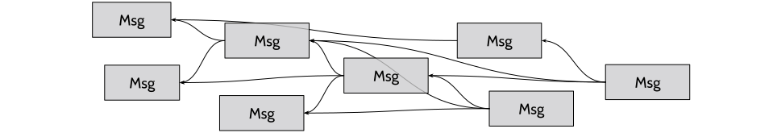

##### UPW/Protocol/UEP-12: DAG-linked Application Messages <br> Rev#0: 4/10/2023 by Core Dev Team <br> Status: Deploy


# DAG-linked Application Messages

| UEP-6:2B | UEP-7:10B | UEP-12 |
|:----|:-----|:-----|

## Motivation
DAG-linked application messages provide a reliable in-swarm message flow
for applications on top of unreliable swarm broadcast (UEP-10).
Application messages will be available for a period of time hosted by active peers
in the swarm.

In each swarm, there will be no more than one instance of the application message flow
with its own configuration. A peer in the swarm will synchronize and maintain a full
copy of the entire message flow. 
Any new message will be broadcasted, validated and appended in the flow by every peer.

## Directed Acyclic Graph of Messages

To detect packet missing in a peer, all application messages are organized as a 
directed acyclic graph. A new message will refer a few existing messages by their `msg_hash`,
which is the first 8-byte of `SHA256` result computed over the entire message.
When a new message is received, the availability of its referred messages will be checked and 
any unexpired missing messages will be pulled.



When composing a new message, it will refer existing messages that are recent and fewer referred.
An existing message being referred in multiple messages is acceptable, while it can be referred 
only by messages with greater timestamp and ones with equal or later expiration time are preferred.
A malicious message can be constructed to have an acyclic referring structure, however, it 
will be effectively treated as acyclic in pulling missing messages.

## Time-To-Live and Epoch
Each application message has a TTL up to a maximum value. 
The TTL is defined in *epochs*, which is a time unit. Both the maximum TTL and the epoch unit are 
swarm-specific configuration that is agreed on by all peers in the swarm. 
An epoch should be configured greater than a safe boundary (e.g. 1 minute) that is much longer 
than the broadcast convergence time for a single MTU packet.

Each message carries a timestamp in millisecond so that the the exact expiration time can be derived.
In swarm broadcast (UEP-10), the high 32-bit of the timestamp is already embedded, which is a timestamp
in 65536-millisecond unit. In application messages layer, only the low 16-bit is encoded.


## Messages
The size of a message is typical within a single MTU, while few-MTU-sized messages are legal and delivered 
via fragmented packets protocol (UEP-7). Every message have a common header as
```
<header> := <0x79><opcode:1byte>
```
`<0x79>` is the protocol indicator as listed in UEP-5, `opcode` defines the actual operation and data structure of the packet.

### Content Message (`opcode:0x10`)
Push a message to remote peers for broadcasting a new message composed in local or replying pull request from others.
```
<header><version:1byte><pow_nonce:8bytes><timestamp:6bytes><ttl_epoch:2bytes><msg_refer_count:3bits><reserved:5bits>[<msg_hash:8bytes><epoch_diff:2bytes>:msg_refer_count]<payload:* bytes>
```
* `version` is the version of the push message, which is `0x5` currently. 
* `timestamp` is the unix timestamp in millisecond. 
* `ttl_epoch` is the number of epochs before expiration.
* `pow_nonce` is the nonce for a small proof-of-work described later. 
* `payload` is the message envelop described in UEP-13.

A message may carry references to 0~4 existing message(s) as specified by `msg_refer_count`. 
Each reference is a pair of the hash of an existing message `msg_hash` and
its expiration time difference in epoch to the current message, `epoch_diff`.
`epoch_diff = message_expiration - referee_expiration` is a signed 16-bit integer, 
which will be saturated if the actual value overflows.

### Pull Messages (`opcode:0x20,0x21`)
Specific messages can be pulled by sending a query (`0x20`) specifying a listed of desired `msg_hash` as
```
<header><count:1byte>[<msg_hash:8bytes>:count]
```
Also messages with timestamps within a specific range from `start_time` to `end_time` in millisecond
can pulled by sending a query (`0x21`) as
```
<header><ticket:4bytes><start_time:6bytes><end_time:6bytes>
```
Both types of query will be fully, partially, replied with multiple push messages (`0x21`) carrying
actual message payload as requested.
In addition, time-ranged query (`0x21`) may be replied with messages of a different type (`0x11`),
in which the `ticket` will be echoed as an opaque data.

### Time-Ranged Message List (`opcode:0x11`)
When there are too much messages matched in the time range of a pull message (`0x21`) query, 
a remote peer may reply a hash list of matched unexpired messages in chronological order as
```
<header><ticket:4bytes><start_time:6bytes><end_time:6bytes><count:1byte>[<msg_hash:8bytes>:count]
```
`ticket` echoes the one in the pull message to ensure the reply is sent from the peer being requested,
which is the similar design in UEP-11.
`start_time/end_time` is the actual time range of messages be included in the list.

## Message Life-Cycle
A Message broadcasted as a DAG-linked application Message will be relayed, served and stored in every peers 
in the swarm until expired, which is determined simply as `timestamp + ttl_epoch*epoch`. 
After that, the message will be removed from the storage and stopped of serving even if it is referring
a yet-expired message.

`ttl_epoch=0` is a legal message by treating as `ttl_epoch=1`, but is pushing only, which will never
be discovered by message pulling.

## Anti-Spamming
In any content message (`0x10`), `pow_nonce` presents a tiny proof-of-work to eliminate exhaustive spamming.
The *work* is computed by `SHA256` over the entire message plus the `timestamp` in UEP-10 header:
```
<Work:32bytes> := SHA256(<timestamp><header><version><pow_nonce><ts_low><ttl_epoch><msg_refer_count><reserved>[<msg_hash><epoch_diff>:*]<payload>)
```
Solving proof-of-work is to search the increasing `pow_nonce` starting from a random initialization.
Proof-of-work is fulfilled when `Work` is less than a fixed `pow_target` by comparing as 32-bytes big unsigned integers.
```
pow_target = (1<<256)/100,000
```


###### Copyright waived via Creative Commons